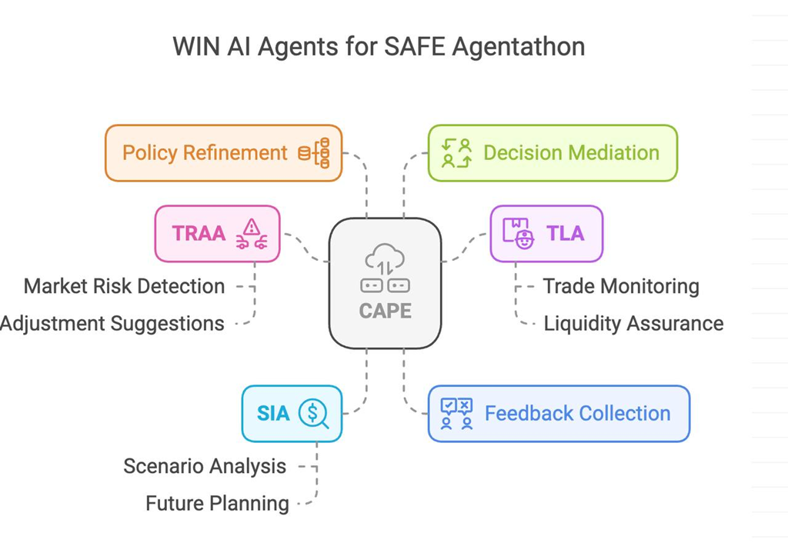

Below is an integrated description of all four agents—including their individual policies—with CAPE (Centralized Adaptive Policy Engine) as the overseer that uses reinforcement learning (with verifiable feedback) to update policies. Each agent's policy acts as an exogenous input to its peers, ensuring that risk assessments, liquidity management, and strategic decisions are transparent, adaptive, and aligned with overall performance. Human oversight remains integral when CAPE proposes policy changes.

---

## 1. Transaction Risk Assessor Agent (TRAA)

**Role:**  
Evaluates the risk of proposed transactions before execution using both on-chain data and oracle-verified news analysis.

**Key Features:**
- Integrated with high-risk approval workflow
- Real-time risk assessment and monitoring
- Multi-factor risk evaluation
- Automated approval routing

**Workflow:**
- **Receive Proposals:**  
  - Accepts transaction proposals from external sources (e.g., trading algorithms or human users via Safe{Wallet}).
- **Data Acquisition:**  
  - **Market Data:** Integrates directly with on-chain oracles (e.g., Chainlink) and, if needed, off-chain APIs.  
  - **Liquidity Data:** Directly queries on-chain sources (e.g., DEX pool sizes) and off-chain order books.  
  - **News Data:** Fetches and analyzes news through Chainlink oracle network for real-time market sentiment and risk assessment.
  - **Counterparty Risk:** Retrieves smart contract audit records, reputations, decentralized risk scores, and oracle-verified news sentiment.
- **Risk Analysis:**  
  - Simulates transactions using Safe{Core} to estimate gas costs and potential slippage.  
  - Assesses market volatility, liquidity conditions, counterparty risks, and transaction sizes.
  - Evaluates news sentiment and market trends from oracle-verified sources.
  - Combines on-chain metrics with news-based risk indicators for comprehensive assessment.
- **Risk-Based Approval Flow:**
  - Determines risk level (LOW, MEDIUM, HIGH, CRITICAL)
  - Routes high-risk decisions through approval workflow
  - Creates detailed approval requests for human review
  - Monitors approval status and expiration
- **Preliminary Recommendation:**  
  - Issues an initial Approve/Reject/Modify recommendation along with a detailed justification.
  - Includes news-based insights and sentiment analysis in the recommendation.
- **Feedback Integration:**  
  - Receives liquidity feedback from TLA and strategic alignment feedback from SIA.
  - Incorporates aggregated insights from CAPE before finalizing recommendations.

**Policy – TRAA Policy:**  
- **Content:**  
  - Defines thresholds for acceptable market volatility, transaction size limits, maximum allowable slippage, and counterparty risk parameters.
  - Establishes criteria for simulating transaction outcomes (e.g., gas cost limits, slippage margins).
  - Sets thresholds for news-based risk indicators and sentiment analysis.
  - Defines oracle data verification requirements and trust parameters.
  - Specifies risk level thresholds and approval requirements:
    - HIGH risk: Exposure ≥ 100,000 ETH
    - CRITICAL risk: Exposure ≥ 500,000 ETH
    - Additional factors: market volatility, credit rating, news sentiment
- **Purpose:**  
  - Serves as the baseline decision-making framework for risk evaluation.
  - Provides exogenous feedback for both TLA (liquidity considerations) and SIA (strategic alignment).
  - Ensures reliable integration of news-based market intelligence.
  - Manages approval workflow for high-risk decisions.
- **Adaptation:**  
  - Updated periodically via CAPE's reinforcement learning process when performance data and external feedback indicate that adjustments would lead to improved outcomes.
  - Incorporates historical accuracy of news-based predictions in policy updates.
  - Adjusts risk thresholds based on historical approval patterns.

### Risk Assessment Interface
```typescript
interface RiskAssessment {
    riskLevel: RiskLevel;
    requiresApproval: boolean;
    factors: {
        exposureAmount: string;
        marketVolatility: number;
        creditRating: string;
        newsSentiment: string;
    };
    recommendation: {
        action: 'APPROVE' | 'REJECT' | 'NEEDS_APPROVAL';
        reasoning: string;
        approvalRequestId?: string;
    };
}
```

### On-chain Functions
```typescript
async proposeRiskMitigation(
    asset: string,
    amount: string,
    recipientAddress: string,
    newsOracleData?: NewsAnalysis
): Promise<SafeTransaction>

async assessRisk(
    exposureData: ExposureData,
    marketData: MarketData
): Promise<RiskAssessment>

async handleApprovalWorkflow(
    assessment: RiskAssessment,
    proposedAction: CounterpartyAction
): Promise<void>
```

### Input Data Structure
```typescript
interface MarketData {
    asset: string;
    currentPrice: string;
    priceChange24h: number;
    volatility30d: number;
    volume24h: string;
    currentExposure: string;
    newsAnalysis?: {
        sentiment: 'positive' | 'negative' | 'neutral';
        riskLevel: 'low' | 'medium' | 'high';
        keyInsights: string[];
        timestamp: number;
    }
}
```

### Sample OpenAI Prompt
```
Analyze the following market conditions and provide a risk assessment:

Market Data:
- Asset: ${marketData.asset}
- Current Price: ${marketData.currentPrice}
- 24h Price Change: ${marketData.priceChange24h}%
- 30-day Volatility: ${marketData.volatility30d}
- Trading Volume: ${marketData.volume24h}
- Current Exposure: ${marketData.currentExposure}

News Analysis (Oracle-Verified):
- Market Sentiment: ${marketData.newsAnalysis?.sentiment || 'No data'}
- Risk Level: ${marketData.newsAnalysis?.riskLevel || 'No data'}
- Key Insights: ${marketData.newsAnalysis?.keyInsights?.join(', ') || 'No data'}
- Last Updated: ${new Date(marketData.newsAnalysis?.timestamp * 1000).toISOString() || 'No data'}

Risk Limits:
- Maximum Exposure: ${maxExposure}
- VaR Limit: ${varLimit}
- Volatility Threshold: ${volatilityThreshold}
```

### Expected AI Response Structure
```json
{
    "valueAtRisk": 120000,
    "volatility": 0.45,
    "exposure": 1000000,
    "breachesLimit": true,
    "recommendedAction": "reduce_position",
    "suggestedReduction": 200000,
    "confidence": 0.95,
    "newsBasedRisk": {
        "level": "medium",
        "factors": [
            "Recent negative press coverage",
            "Regulatory concerns in news"
        ],
        "oracleVerified": true,
        "lastUpdated": "2025-02-14T15:32:57Z"
    }
}
```
---
## 2. Treasury & Liquidity Agent (TLA)

**Role:**  
Manages the Safe’s liquidity to ensure transactions are executed without jeopardizing short-term cash flows, while optimizing yields on idle assets.

**Workflow:**
- **Liquidity Monitoring:**  
  - Continuously tracks current asset balances (e.g., stablecoins, ETH, tokens).
  - Monitors projected inflows (staking rewards, scheduled transfers) and outflows (approved transactions, operational expenses).
  - Assesses liquidity ratios (current, quick ratios) tailored to the DeFi context.
- **Proposal Evaluation:**  
  - Reviews TRAA’s transaction proposals against real-time liquidity conditions.
  - Provides responses:
    - **Sufficient Liquidity:** Transaction is feasible.
    - **Insufficient Liquidity:** Transaction would compromise liquidity.
    - **Conditional Approval:** Transaction is acceptable if specific liquidity conditions (e.g., maintaining minimum reserve levels) are met.
- **Cash Flow Management:**  
  - Executes inter-account transfers (e.g., between hot wallets and cold storage).
  - Interacts with DeFi protocols for yield generation, following guidance from SIA.
- **Feedback & Reporting:**  
  - Reports liquidity constraints and opportunities to TRAA and SIA.
  - Supplies data to CAPE for refining liquidity thresholds.

**Policy – TLA Policy:**  
- **Content:**  
  - Sets minimum reserve levels, defines acceptable liquidity ratios, and establishes thresholds for cash flow transfers.
  - Determines parameters for yield-generation activities under varying market conditions.
- **Purpose:**  
  - Acts as an exogenous guideline for TRAA (impacting transaction sizing and timing) and SIA (influencing long-term asset allocation).
- **Adaptation:**  
  - Subject to periodic updates via CAPE’s RL process, which factors in historical liquidity performance and real-world outcomes to optimize liquidity management.

### On-chain Functions
```typescript
async proposeSettlement(
    tradeId: string,
    amount: string,
    counterparty: string
): Promise<SafeTransaction>

async lockCollateral(
    amount: string,
    escrowContract: string
): Promise<SafeTransaction>
```

### Input Data Structure
```typescript
interface TradeLifecycleData {
    tradeId: string;
    eventType: 'initiation' | 'settlement' | 'maturity' | 'default';
    settlementAmount: string;
    counterparty: string;
    requiredCollateral: string;
    status: 'pending' | 'active' | 'settling' | 'completed' | 'defaulted';
}
```
---

## 3. Strategic Investment Agent (SIA)

**Role:**  
Defines and maintains the long-term investment strategy and portfolio allocation to ensure that transactions align with overarching investment objectives.

**Workflow:**
- **Strategy Definition:**  
  - Establishes overall investment goals (e.g., capital preservation, growth, income), risk tolerance, and target asset allocations.
  - Determines investment horizons and acceptable deviation ranges.
- **Transaction Assessment:**  
  - Evaluates TRAA’s risk assessments to determine if transactions align with the strategic framework.
  - Issues strategic feedback:
    - **Strategically Aligned:** Transaction fits within predefined asset allocation and risk tolerance.
    - **Strategically Misaligned:** Transaction deviates from the long-term strategy.
    - **Conditional Alignment:** Transaction acceptable if paired with balancing adjustments (e.g., rebalancing trades).
- **Guidance to TLA:**  
  - Communicates long-term asset allocation targets and risk tolerance levels.
  - Advises on yield-generation strategies in accordance with liquidity status.
- **Performance Monitoring & Adjustment:**  
  - Regularly tracks portfolio performance against benchmarks.
  - Adjusts investment strategies based on market trends, portfolio performance, and feedback.
- **Feedback Sharing:**  
  - Provides strategic insights to CAPE to refine investment policies.

**Policy – SIA Policy:**  
- **Content:**  
  - Specifies risk tolerance levels, asset allocation percentages, target returns, and rebalancing conditions.
  - Contains rules for evaluating transaction proposals for strategic consistency.
- **Purpose:**  
  - Provides clear, exogenous parameters for both TRAA (to ensure transactions fit the overall strategy) and TLA (to optimize yield generation in alignment with strategic goals).
- **Adaptation:**  
  - Continuously refined by CAPE using reinforcement learning, based on verifiable portfolio performance data and external market conditions.

### On-chain Functions
```typescript
async proposeInvestment(
    asset: string,
    amount: string,
    isEntry: boolean
): Promise<SafeTransaction>

async proposeHedge(
    hedgeContract: string,
    amount: string,
    direction: 'long' | 'short'
): Promise<SafeTransaction>
```

### Sample OpenAI Prompt
```
Analyze these market and portfolio conditions:

Market Conditions:
- Market Trend: ${strategyData.marketTrend}
- Volatility Index: ${strategyData.volatilityIndex}
- Interest Rates: ${strategyData.interestRates}

Portfolio Status:
- Current Allocation: ${JSON.stringify(strategyData.currentAllocation)}
- Performance: ${strategyData.performance}
- Risk Metrics: ${JSON.stringify(strategyData.riskMetrics)}
```
---

## 4. CAPE – Centralized Adaptive Policy Engine

**Role:**  
Serves as the central communication and policy update hub, owning the policies of all agents and using reinforcement learning to propose improvements.

**Workflow:**
- **Data Ingestion & Feedback Collection:**  
  - Aggregates exogenous inputs (market data, human feedback) and internal feedback from TRAA, TLA, and SIA.
- **Aggregation & Analysis:**  
  - Employs reinforcement learning techniques to process performance metrics and feedback.
  - Detects conflicts and inconsistencies among agent recommendations.
- **Policy Adaptation & Dissemination:**  
  - Dynamically adjusts internal thresholds and decision-making parameters for TRAA, TLA, and SIA.
  - When the RL model identifies a policy update that would likely enhance overall performance, CAPE generates a proposal for human-in-the-loop review.
- **Mediation:**  
  - Acts as the arbiter that harmonizes risk assessments, liquidity constraints, and strategic alignment into a cohesive decision framework.
- **Verifiable Feedback:**  
  - Uses clearly defined reward functions tied to verifiable outcomes such as transaction success rates, risk mitigation performance, liquidity adequacy, and strategic alignment.
  - Ensures that every policy update is data-driven, auditable, and subject to human validation.

**Policy – CAPE Policy:**  
- **Content:**  
  - Integrates performance metrics from all agents into a reinforcement learning model.
  - Defines reward functions and penalty metrics based on verifiable feedback (e.g., reduced transaction failures, improved liquidity ratios, better portfolio alignment).
- **Purpose:**  
  - Owns and governs the policies of TRAA, TLA, and SIA.
  - Ensures that policy updates are optimal and beneficial, with proposals sent to a human decision-maker for final approval.
- **Adaptation:**  
  - Continuously learns from operational outcomes, historical data, and external inputs.
  - Employs transparent, verifiable RL techniques to update and disseminate policy adjustments across the system.

### On-chain Functions
```typescript
async requestCollateralCall(
    counterparty: string,
    amount: string,
    deadline: number
): Promise<SafeTransaction>

async updateCounterpartyLimits(
    limitsContract: string,
    counterparty: string,
    newLimit: string
): Promise<SafeTransaction>
```

### Input Data Structure
```typescript
interface ExposureData {
    counterpartyId: string;
    creditRating: string;
    currentExposure: string;
    exposureLimit: string;
    collateralHeld: string;
    netPosition: string;
    marketVolatility: number;
}
```
---

## Overall Agent Interactions & Workflow

1. **Transaction Initiation:**  
   - **TRAA** receives a transaction proposal and gathers the necessary market, liquidity, and counterparty data.
2. **Initial Assessment:**  
   - **TRAA** simulates the transaction and issues a preliminary risk recommendation using its current policy.
3. **Liquidity & Strategy Verification:**  
   - **TLA** evaluates the proposal against its liquidity policy and provides a liquidity status (sufficient, insufficient, or conditional).
   - **SIA** reviews the proposal against its strategic policy and provides strategic alignment feedback.
4. **Centralized Policy Refinement:**  
   - **CAPE** collects all feedback (internal from TRAA, TLA, SIA, and external sources) and applies its RL-based analysis.
   - It identifies potential policy improvements for any agent and, if the updated policy is likely to improve overall performance, CAPE proposes the change to the human-in-the-loop.
5. **Final Decision & Execution:**  
   - **TRAA** finalizes its recommendation based on the integrated feedback and updated policies.
   - The approved transaction is executed via the Safe smart account, with human oversight as needed.
6. **Continuous Learning Loop:**  
   - Each agent integrates policy updates received from CAPE into their decision-making processes.
   - CAPE’s RL model continuously refines policies based on verifiable, auditable feedback from the overall system performance.

### AI Response Mapping
The AI's recommendations are mapped to on-chain actions as follows:

1. Collateral Calls
```json
{
    "collateralAction": {
        "action": "request_collateral",
        "amount": "100000",
        "deadline": 86400,
        "reason": "Exposure limit breach"
    }
}
```
Maps to: `requestCollateralCall(counterparty, amount, deadline)`

2. Exposure Adjustments
```json
{
    "exposureAction": {
        "action": "reduce_exposure",
        "amount": "50000",
        "asset": "0x...",
        "timeline": "immediate"
    }
}
```
Maps to: `reduceExposure(counterparty, amount, asset)`


This unified framework ensures that each agent operates with a clear, exogenously defined policy, while CAPE continuously refines these policies using reinforcement learning and verifiable feedback. The approach guarantees that transaction risks, liquidity constraints, and strategic objectives are balanced in a transparent, adaptive, and auditable manner—with human oversight when key policy changes are proposed.
