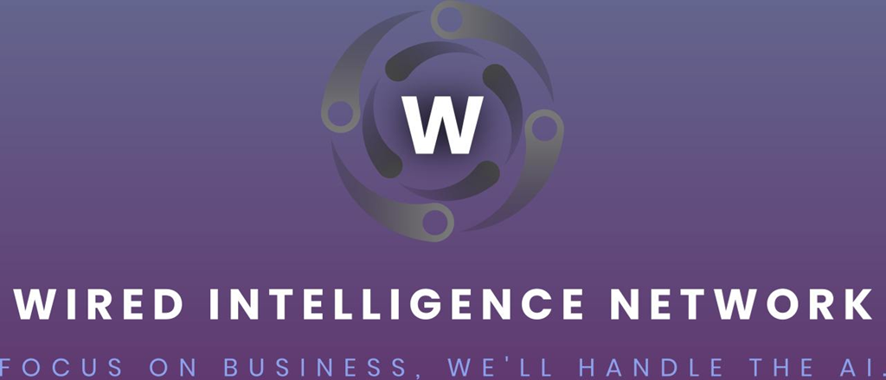

# SAFE-Agentathon

## WIN Project – AI Agents on SAFE Smart Accounts (SAFE Agentathon 2025) 
This project is created by [Wired Intelligence Network](https://win4.ai/) team (further WIN) exclusievly for SAFE Agentathon 2025. WIN is an innovative AI-driven automation project building for non-technical founders and industry experts. WIN showcases a new [B2A2X (Business-to-AI-to-Everything) business model](https://open.substack.com/pub/ruslankarmanny/p/the-allocative-revolution-why-b2a2x) , where a business delegates operations to autonomous AI agents that interact with any party or system on its behalf. By leveraging **SAFE's smart account infrastructure**, WIN enables these agents to securely manage on-chain tasks and assets, addressing the challenge of trusting AI with real financial and data-driven decisions. The result is a framework that **streamlines business processes via AI agents** while maintaining blockchain-grade security and transparency.

## Introduction: The B2A2X Model and WIN's Vision
In traditional models, businesses interact directly with consumers (B2C) or other businesses (B2B). **B2A2X** represents a [paradigm shift: Business-to-AI-to-Everything](https://open.substack.com/pub/ruslankarmanny/p/the-allocative-revolution-why-b2a2x). In this model, a business (B) deploys AI **Agents (A)** that autonomously engage with any relevant party or service (X could be customers, markets, other businesses, etc.) to execute tasks. WIN demonstrates this vision by introducing AI agents as **autonomous intermediaries**. This approach can improve scalability (agents work 24/7), personalization (AI can tailor interactions per user), and efficiency (reducing manual oversight), all while ensuring the business retains control and oversight through SAFE's smart contract safeguards.

[**WIN's core vision**](https://win4.ai/) is to empower businesses to **trust AI agents with on-chain operations** without sacrificing security or privacy. By using Safe's battle-tested smart accounts, WIN ensures that every agent action – whether making a payment, adjusting a contract, or analyzing data – occurs under strict conditions defined by the business. This alignment of AI autonomy with decentralized safety embodies [**SAFE's own vision of an agent-driven blockchain economy​**](https://safe.mirror.xyz/V965PykKzlE1PCuWxBjsCJR12WscLcnMxuvR9E9bP-Y) [safe.global.](https://safe.global/blog/safe-agentathon-launches-with-200k-in-bounties-for-ai-native-smart-accounts#:~:text=sovereignty%20%E2%80%93%20powered%20by%20her,chain%20AI%20agents) 

WIN addresses a key problem: *How can we harness AI's speed and intelligence in Web3 without introducing new risks?* The solution is a framework where **SAFE smart accounts act as the trusted environment for AI**, providing programmable rules and multi-signature controls to keep agents in check even as they operate with a high degree of independence​.

## Security and Risk Management

WIN implements a comprehensive security framework to ensure safe operation of AI agents:

### High-Risk Decision Approval Workflow
A sophisticated approval workflow system manages high-risk decisions across all agents:
- **Risk Assessment**: Automated evaluation of transaction risk based on multiple factors:
  - Transaction value thresholds
  - Market volatility
  - Credit ratings
  - News sentiment analysis
- **Approval Process**: Multi-step verification for high-risk actions:
  - Automatic risk level determination
  - Creation of detailed approval requests
  - Human review for critical decisions
  - Time-bound approval windows
- **Safety Controls**: 
  - 24-hour expiration on pending approvals
  - Immutable approval records
  - Automated monitoring and alerts
  - Comprehensive audit trails

For detailed information about the approval workflow, see [Approval Workflow Documentation](./approval-workflow.md).

## How It Works: AI Agents within SAFE Smart Accounts

WIN deploys four specialized AI agents within a Safe smart account, each with distinct roles that together handle end-to-end business processes in a decentralized manner. These agents operate collectively, governed by Safe's smart account logic (multi-sig rules, modules, and guards), to ensure secure and efficient outcomes. The agents include:

**TRAA (Trust & Risk Assessment Agent)** – Monitors transactions and decisions in real-time to enforce compliance and risk thresholds. Before any on-chain action is executed, TRAA evaluates its safety against business-defined policies and analyzes real-time news feeds through a decentralized oracle network. For example, if a payment exceeds a certain amount, negative news about a counterparty emerges, or a rule is violated, TRAA can flag or veto the transaction. This agent effectively acts as an on-chain risk manager, leveraging Safe's capabilities (like Transaction Guards) and Chainlink's oracle network to [prevent unauthorized or harmful operations](https://safe.mirror.xyz/V965PykKzlE1PCuWxBjsCJR12WscLcnMxuvR9E9bP-Y). By using Safe's programmable guard hooks and verifiable news data from oracles, TRAA ensures only vetted actions are executed, even if other agents propose them, adding a critical layer of trust.

**TLA (Transactional Learning Agent)** – Continuously learns from ongoing operations and optimizes them. TLA analyzes data from multiple sources:
- Safe account activity (payments, interactions, usage patterns)
- On-chain oracle data (market conditions, news sentiment)
- External APIs and data feeds
This comprehensive data analysis helps improve efficiency. For instance, it might observe gas costs, transaction frequencies, market sentiment from oracle-verified news, and suggest batching or scheduling to save costs. TLA could autonomously adjust strategies (within allowed parameters) – such as timing trades or reallocating funds – based on both historical data and current market conditions from trusted oracle

**SIA (Stakeholder Interaction Agent)** – Handles all external communications and interactions on behalf of the business. SIA can interface with customers (e.g., responding to user requests, initiating payouts), with other businesses or services (triggering smart contract calls, oracle queries), or with data feeds/APIs. Operating through the Safe account, SIA ensures that any outgoing payments or messages are signed and recorded on-chain for transparency. Because SIA uses the Safe smart account as its identity and wallet, partners and customers can interact with “the business’s AI” confidently, knowing the agent’s actions are verifiable on-chain. Safe’s multi-owner structure allows the human owners and SIA to co-own the account, so SIA’s autonomy can be [dialed up or down as needed​](https://safe.mirror.xyz/V965PykKzlE1PCuWxBjsCJR12WscLcnMxuvR9E9bP-Y). This agent effectively serves as the “face” of the business in the decentralized world, powered by AI.

**CAPE (Coordinated Autonomous Planning Engine)** – The orchestrator and decision-maker that coordinates the other agents' activities. CAPE analyzes high-level goals set by the business and plans out tasks for TRAA, TLA, and SIA. It can incorporate human expert feedback into its decision-making process, allowing for a balanced approach that combines AI analysis with human expertise. For example, if the business goal is to manage a treasury and engage users, CAPE might plan a budget (which TRAA will enforce), investment or yield strategies (with input from TLA's learning and human risk assessments), and user reward distributions (executed via SIA). CAPE uses Safe's infrastructure to execute multi-step plans: it can bundle multiple actions into atomic Safe transactions or schedule future transactions using Safe modules. With Safe's multisig features, CAPE can require approval from TRAA for high-risk steps, ensuring consensus among agents for [critical moves​](safe.mirror.xyz). CAPE essentially gives the WIN system its autonomy in achieving complex objectives, while Safe provides the reliable transaction framework and governance.

All four agents are integrated through the SAFE smart account, which acts as a shared wallet and rule-enforcement engine. We configured the Safe account such that each agent is an owner with specific signing privileges, and critical transactions might require multiple agents’ consent. Thanks to Safe’s flexible account abstraction, this setup is possible with on-chain logic rather than hardcoding trust in any [single agent](safe.mirror.xyz). For instance, the SAFE can be set as an M-of-N multisig (M out of 4 agents) for certain actions, decentralizing control even among the [AI agents themselves](safe.mirror.xyz). This means WIN can prevent a single faulty agent from misbehaving — a true demonstration of decentralized AI governance. Safe’s infrastructure (with features like guardians, spending limits, and guard contracts) acts as the safety net and controller for the entire AI agent ensemble, allowing the business to confidently “let go” of day-to-day micromanagement and let the agents handle it, knowing that the Safe account will uphold the business’s rules at all times.

## Why SAFE? (Privacy, Cost Efficiency, and Decentralization)
SAFE’s smart account infrastructure is **crucial for making AI adoption feasible on-chain**. [WIN](https://win4.ai/) leverages SAFE to ensure that our AI agents operate with the same security, efficiency, and decentralization that define the Web3 ethos. Here’s why SAFE is the foundation of this project and how it aligns with the needs of AI agents:

**Security & Privacy:** SAFE accounts are non-custodial and highly secure – they currently secure [over $100B in assets on-chain](https://safe.global/core). For [WIN](https://win4.ai/), this means the business’s funds and data are protected by battle-tested smart contracts rather than a single private key or centralized service. **Privacy** is preserved since the business does not have to expose private keys or sensitive credentials to the AI agents directly; instead, agents are added as SAFE co-owners or modules with only the permissions they need. The SAFE’s on-chain rules act as a transparent yet privacy-preserving layer – only the intended transactions are published, and no centralized intermediary learns the business’s strategies or the AI’s internal logic. By using SAFE, we avoid having to trust a cloud AI service with treasury keys, mitigating a huge security risk. In short, Safe gives our AI agents a secure sandbox to operate in, where every action is authorized and logged, but **the business retains ultimate control**.

**Cost Efficiency:** SAFE’s account abstraction and compatibility with multiple networks allow WIN to minimize costs. For example, SAFE smart accounts can batch multiple operations into one transaction and enable meta-transactions (gas sponsorship), reducing gas fees for complex sequences. Our AI agents can operate on **cost-effective chains (L2s or sidechains like Polygon or Gnosis Chain)** using the same [SAFE interface](https://safe.mirror.xyz/V965PykKzlE1PCuWxBjsCJR12WscLcnMxuvR9E9bP-Y), which dramatically cuts costs for high-frequency tasks. The Transaction Delegation features mean an AI agent’s transactions could be sponsored or paid from the SAFE itself, so the agent isn’t stuck when it runs out of ETH for gas. Additionally, SAFE Modules such as spending limits ensure that even if an agent tries to execute many transactions, it stays within [daily gas budgets​](https://docs.safe.global/advanced/smart-account-modules). This efficient design allows the business to get maximum value from AI automation without runaway costs – every agent action is optimized and controlled.

**Decentralization & Trustlessness:** SAFE provides a decentralized trust model which is essential for AI agents that might be handling valuable operations. Instead of relying on a centralized server or single signer, SAFE enables **multi-sig control and on-chain logic**, meaning no single point of failure. In WIN’s case, the four agents collectively manage the account – a design made possible only because SAFE allows [multiple owners and programmable thresholds​](safe.mirror.xyz). This decentralization extends to recovery and governance: the business (or community) could add human co-signers or require a human “approval” agent for certain actions, blending AI autonomy with human oversight via the SAFE. Moreover, because SAFE is an open system on Ethereum and other EVM chains, anyone can verify the agents’ actions on-chain, which builds **trust with stakeholders**. The importance of SAFE’s infrastructure for AI adoption is underscored by the broader industry: as noted by SAFE’s team, **smart accounts are critical infrastructure for the coming [agent economy​](safe.mirror.xyz).** AI agents will not be using legacy EOAs; they need the programmable, modular security that SAFE offers to reach their full potential on Web3. [WIN](https://win4.ai/) directly aligns with this insight – it shows how an AI-driven business can run **entirely on smart accounts**, benefiting from decentralization at every level (from execution to oversight).

By combining these advantages, SAFE’s infrastructure ensures that **AI agents can be adopted without compromise**. [WIN](https://win4.ai/)’s agents operate with confidence because privacy is respected, costs are kept sustainable, and decentralization guarantees fairness and resilience. This synergy is exactly why SAFE was the backbone of our solution: it transforms what could be a risky experiment in AI autonomy into a robust, **real-world viable model**. We believe this approach embodies SAFE’s AI vision, proving that autonomous agents and smart accounts together can unlock new possibilities in [decentralized business](safe.global).

## Setup Guide (Quick Start)
Interested in exploring or demoing [WIN](https://win4.ai/)? Here’s a brief guide to get you started. (For detailed instructions, please see SAFE’s documentation links provided.)

1. **Prerequisites:** Ensure you have **Node.js** and **npm/yarn** installed, and a Web3 wallet (like MetaMask) for deploying a SAFE. You’ll also need an API key or RPC endpoint for the Ethereum network (or testnet) you plan to use. We recommend starting on a testnet (e.g., Sepolia or Polygon Mumbai) for testing the WIN agents.

2. **Clone the Repository:** Download or clone this GitHub repo to your local machine. Then install the dependencies by running: `npm install` (or `yarn install`) in the project directory. This will set up the necessary SDKs including the Safe{Core} SDK.

3. **SAFE Smart Account Setup:** Create a SAFE smart account for the AI agents. You can do this via the SAFE web interface or programmatically. For a simple demo, you might start with a 1-of-1 SAFE (the AI agent as the sole owner) to mimic an [autonomous agent account​](https://docs.safe.global/home/ai-agent-quickstarts/basic-agent-setup). SAFE provides a quickstart guide **to equip an AI agent with a SAFE account​**. In our case, you would set the owner(s) of the Safe to keys controlled by the WIN agents (which can be simulated by scripts or processes running locally).
   
   - If using code, you can use the Safe Protocol Kit to deploy a new SAFE contract with a given owner. (See SAFE’s docs for code snippets on initializing a SAFE client and deploying [a SAFE account](https://docs.safe.global/home/ai-agent-quickstarts/basic-agent-setup).)
   - Note: A 1-of-1 setup (one agent controls the SAFE) is the simplest, but not the most secure – in a real scenario, you might use a 2-of-3 or 2-of-4 multi-sig among agents and a human, etc., as **described in SAFE’s [multi-agent setup guide​](https://docs.safe.global)**. For hackathon purposes, start simple, then iterate.

4. **Configure Agent Credentials:** Each [WIN](https://win4.ai/) agent (TRAA, TLA, SIA, CAPE) will need access to a signing key or Safe transaction service to act on the SAFE. In a test setup, these can be represented by separate scripts or processes. You should:

  - Create or obtain private keys for each agent (or generate burner keys on testnet).
  - Fund the SAFE with some test ETH (for gas) and any tokens needed for the demo.
  - Update the project’s configuration (maybe a .env file or config files) to include the SAFE contract address and the keys of the agents. The code is structured to load these and instantiate agent clients.

5. **Run the WIN Agents:** Start the agents in the appropriate order. For example:
   
- Launch the **TRAA** process to begin monitoring (it will listen for proposed transactions).
- Launch **TLA** and **SIA** which might initiate actions (TLA performing periodic optimizations, SIA listening for external triggers or user input).
- Finally, launch **CAPE**, which will orchestrate a higher-level scenario (for instance, executing a sample workflow where the agents collaborate).

The exact processes/commands will depend on how we implemented the agents (refer to the repository documentation for specifics on running each agent). The agents communicate with the blockchain via the SAFE account, using our integrated logic. You should see console logs or blockchain transactions as they operate.

6.**Observe and Interact:** With the agents running, you can test the system. For example, simulate a scenario where a new invoice needs paying – SIA could detect it and propose a Safe transaction, TRAA will check it, and CAPE will coordinate final execution. You can interact via CLI prompts or a simple front-end (if provided) to trigger certain actions. All transactions the agents execute will appear on the Safe (check the SAFE’s address on a block explorer). This demonstrates the autonomous flow of funds and data under SAFE’s control.

**Further Configuration:** Explore SAFE’s docs to add more advanced features:

- Set up a Transaction Guard contract on the SAFE to define explicit [allowed agent actions​](https://safe.mirror.xyz/V965PykKzlE1PCuWxBjsCJR12WscLcnMxuvR9E9bP-Y#:~:text=Transaction%20Guards%20are%20another%20feature,to%20performing%20only%20specific%20transactions).
- Add a human owner with a 2-of-2 requirement for very large transactions (demonstrating human-in-the-loop control).
- Use SAFE Modules like a Spending Limit module to cap the daily token spend of the SAFE, regardless of agent activity​. These steps are optional but showcase how flexible SAFE is in customizing the AI agent’s operating envelope.
  
For more details on setting up SAFE smart accounts and integrating AI, refer to Safe’s official documentation: *[“Basic setup to equip your AI agent with a Smart Account”​](https://docs.safe.global/advanced/smart-account-modules))* and the SAFE AI Agents resource hub. SAFE’s docs also cover **multiple agent setups, human approval flows, and other advanced patterns** that can [enhance WIN’s framework​](https://docs.safe.global/home/ai-agent-quickstarts/basic-agent-setup).

*If you encounter issues during setup, please check the repository’s Wiki/Issues for troubleshooting tips or reach out on the Safe community Discord.*

## Conclusion

WIN demonstrates a powerful use-case at the intersection of AI and blockchain: a team of AI agents autonomously running business operations through a SAFE smart account. By solving the trust and security challenges, WIN opens the door to true **AI-driven decentralized organizations**. We believe this prototype highlights the promise of Safe’s infrastructure in enabling an **AI agent economy**, where autonomous services can interact and transact freely, but safely. In line with Safe Agentathon’s goals, WIN showcases how **[AI + Safe = a new paradigm for DeFi, governance, and beyond](https://safe.global/blog/safe-agentathon-launches-with-200k-in-bounties-for-ai-native-smart-accounts)**. We’re excited about this vision and invite you to explore the code, give feedback, or even build on the WIN model. Together, we can push forward the frontiers of what AI agents can achieve in Web3.

## License
This project is released under the **MIT License**, in line with [SAFE’s open-source ethos](https://safe.global/core). See the LICENSE file for details. 
